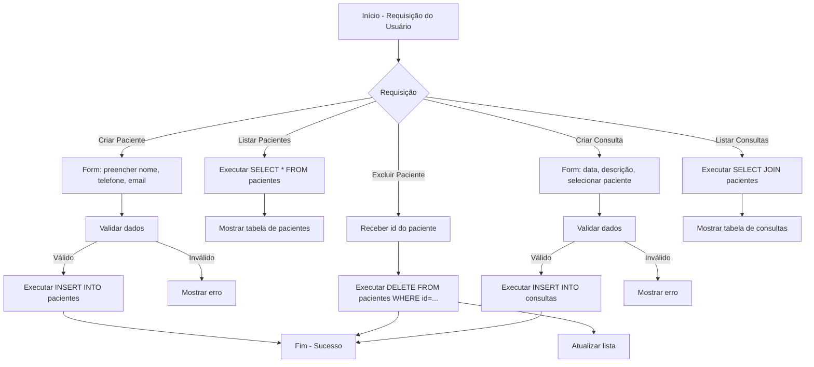
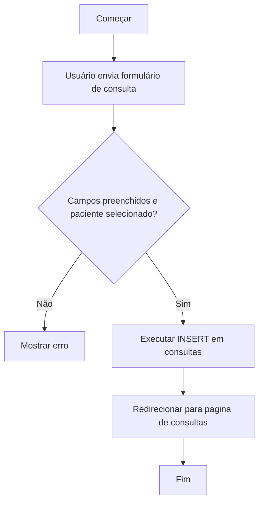

# Fluxograma (Mermaid) - Sistema Odonto Vida

## Fluxograma Geral das Operações CRUD



## Fluxograma - Detalhado: Criação de Paciente

```mermaid
flowchart TD
  A[Começar] --> B[Usuário envia formulário de paciente]
  B --> C{Campos preenchidos?}
  C -->|Não| D[Mostrar mensagem: "Preencha todos os campos"]
  C -->|Sim| E[Executar INSERT no banco]
  E --> F[Redirecionar para pagina de pacientes]
  F --> G[Fim]
```

## Fluxograma - Detalhado: Criação de Consulta


